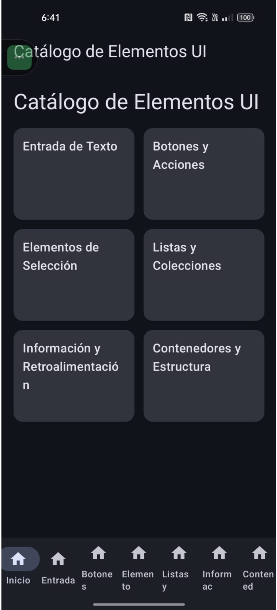
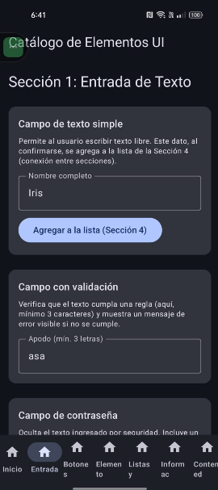
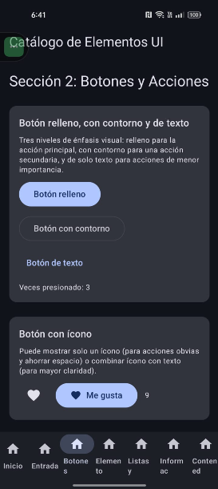
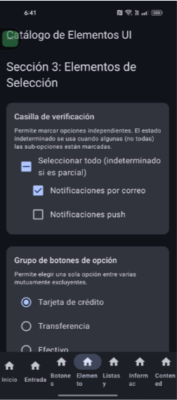
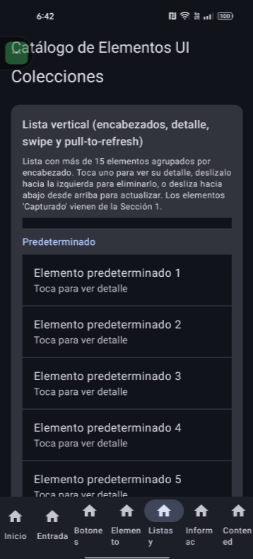
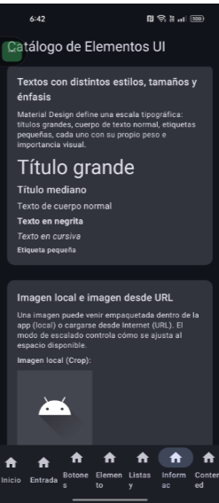
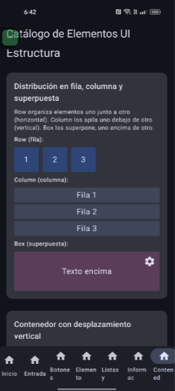

# Catálogo de Elementos UI — Jetpack Compose

Implementación del catálogo interactivo de elementos de interfaz usando **Jetpack Compose** (Kotlin).

## Tecnología

- **Lenguaje:** Kotlin
- **UI Toolkit:** Jetpack Compose (Material 3)
- **Navegación:** Navigation Compose (NavHost + NavigationBar)
- **Carga de imágenes:** Coil

## Cómo compilar y ejecutar

1. Abre Android Studio.
2. `File > Open` y selecciona esta carpeta (`android-compose/`).
3. Espera a que Gradle sincronice las dependencias.
4. Conecta un dispositivo Android o inicia un emulador.
5. Presiona **Run** (o `Shift+F10`).

## Estructura de la app

La app tiene una pantalla principal con acceso a 6 secciones, navegables mediante una barra inferior:

1. **Entrada de Texto** — campos simples, con validación, contraseña, teclados especiales, multilínea, sugerencias automáticas, y barra de búsqueda.
2. **Botones y Acciones** — botón relleno/contorno/texto, con ícono, FAB normal/extendido, toggle, deshabilitado y de carga.
3. **Elementos de Selección** — checkbox (con estado indeterminado), radio buttons, switch, sliders, dropdown, selector de fecha/hora, chips de filtro.
4. **Listas y Colecciones** — lista vertical con encabezados, detalle al tocar, swipe para eliminar, pull-to-refresh, estado vacío, cuadrícula, y pestañas deslizables.
5. **Información y Retroalimentación** — estilos de texto, imagen local y desde URL, progreso lineal/circular, toast/snackbar, diálogo de confirmación, bottom sheet, tarjeta/separador/badge.
6. **Contenedores y Estructura** — Row/Column/Box, contenedor con scroll, barra superior de ejemplo, menú de ejemplo, y distribución con pesos proporcionales.

### Conexión entre secciones

Un texto capturado en el campo simple de la **Sección 1** se agrega, mediante el botón "Agregar a la lista", a la lista vertical de la **Sección 4**, usando un repositorio de datos compartido (`RepositorioListas`).

## Capturas de pantalla

| Sección | Captura |
|---|---|
| Pantalla principal |  |
| Entrada de Texto |  |
| Botones y Acciones |  |
| Elementos de Selección |  |
| Listas y Colecciones |  |
| Información y Retroalimentación |  |
| Contenedores y Estructura |  |