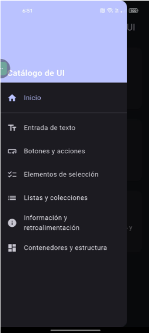
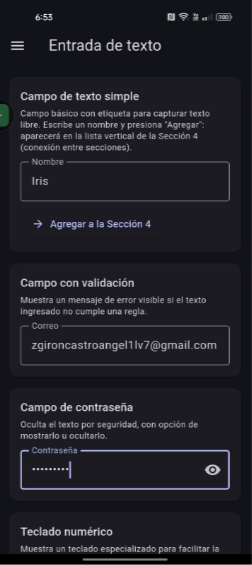
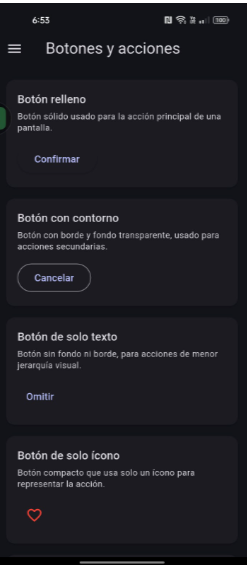
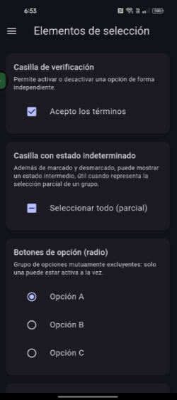
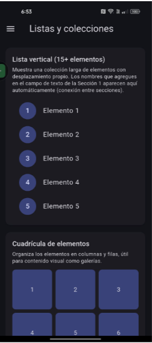
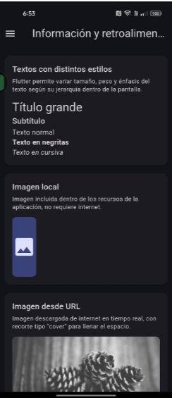
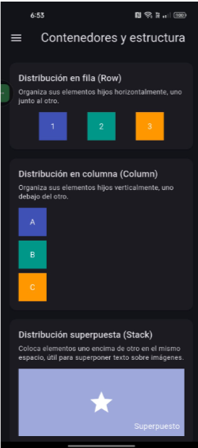

# Catálogo de Elementos UI — Flutter

Implementación del catálogo interactivo de elementos de interfaz usando **Flutter** (Dart).

## Tecnología

- **Lenguaje:** Dart
- **UI Toolkit:** Flutter (Material 3)
- **Navegación:** Navigator (rutas con `MaterialPageRoute`) + `Drawer` como menú lateral
- **Estado compartido:** `ValueNotifier` (sin paquetes externos de gestión de estado)

## Cómo compilar y ejecutar

1. Instala el Flutter SDK (canal stable) y verifica con `flutter doctor`.
2. Abre una terminal en la carpeta de este proyecto (`flutter/`).
3. Instala las dependencias:
   ```
   flutter pub get
   ```
4. Conecta un dispositivo Android o inicia un emulador.
5. Ejecuta la aplicación:
   ```
   flutter run
   ```
6. Para generar el APK de instalación:
   ```
   flutter build apk --release
   ```
   El archivo se genera en `build/app/outputs/flutter-apk/app-release.apk`

## Estructura de la app

La app tiene una pantalla principal con acceso a 6 secciones, navegables mediante un menú lateral (Drawer) disponible en todas las pantallas:

1. **Entrada de Texto** — campo simple, con validación, contraseña con mostrar/ocultar, teclados especiales (numérico, correo, teléfono), multilínea, sugerencias automáticas (`Autocomplete`), y barra de búsqueda (`SearchBar`).
2. **Botones y Acciones** — botón relleno/contorno/texto, con ícono (solo ícono e ícono+texto), FAB normal/extendido, toggle (`ToggleButtons`), selector segmentado, deshabilitado y en estado de carga.
3. **Elementos de Selección** — checkbox (con estado indeterminado), radio buttons, switch, slider de valor único y de rango, dropdown, selector de fecha y de hora, chips de filtro.
4. **Listas y Colecciones** — lista vertical de 15+ elementos, cuadrícula, lista con encabezados de sección, detalle al tocar un elemento, swipe para eliminar (`Dismissible`), pull-to-refresh (`RefreshIndicator`), estado vacío, y pestañas deslizables (`TabBar`/`TabBarView`).
5. **Información y Retroalimentación** — estilos de texto, imagen local y desde URL (con manejo de error de carga), progreso lineal y circular (determinado/indeterminado), toast/snackbar (simple y con acción), diálogo de confirmación, bottom sheet, tarjeta/separador/badge.
6. **Contenedores y Estructura** — Row/Column/Stack, contenedor con scroll vertical, barra superior de ejemplo, demo de navegación inferior (`NavigationBar`), y distribución con pesos proporcionales (`Expanded`).

### Conexión entre secciones

Un texto capturado en el campo simple de la **Sección 1** se agrega, mediante el botón "Agregar a la Sección 4", a la lista vertical de la **Sección 4**, usando un `ValueNotifier<List<String>>` global (`lib/estado_compartido.dart`) como fuente de datos compartida: la Sección 1 escribe en él y la Sección 4 lo escucha con un `ValueListenableBuilder`, actualizándose automáticamente sin necesidad de recargar la pantalla.

## Capturas de pantalla

| Sección | Captura |
|---|---|
| Pantalla principal |  |
| Entrada de Texto |  |
| Botones y Acciones |  |
| Elementos de Selección |  |
| Listas y Colecciones |  |
| Información y Retroalimentación |  |
| Contenedores y Estructura |  |
